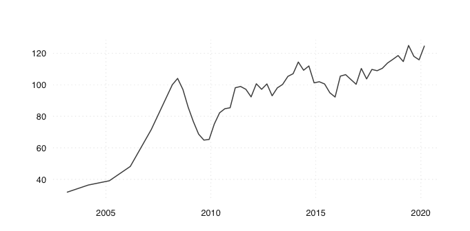

Working with swissdata in R
================
Swissdata team
2020-04-09

``` r
library(tidyverse)
library(jsonlite)
library(tsbox)
```

#### Get latest data and meta information from the internet

read data in a flat structure, meta information in a hierarchical
structure

``` r
url_csv <- "https://raw.githubusercontent.com/swissdata/demo/master/data/ch_adecco_sjmi.csv"
data <- read_csv(url_csv, col_types = cols())

url_json <- "https://raw.githubusercontent.com/swissdata/demo/master/data/ch_adecco_sjmi.json"
meta <- read_json(url_json)
```

#### Example 1: Plot a single time series: Adecco Swiss Job Market Index

``` r
data_sch <- filter(data, idx_type == "sch")
```

Use the [tsbox](https://www.tsbox.help) package to transform a data
frame into a ‘ts’ time series:

``` r
ts_ts(data_sch)
#> [time]: 'date'
#> Time Series:
#> Start = 2003.16666666667 
#> End = 2020.16666666667 
#> Frequency = 4 
#>  [1]  31.900      NA      NA      NA  36.400      NA      NA      NA  39.100
#> [10]      NA      NA      NA  48.200      NA      NA      NA  71.600      NA
#> [19]      NA      NA 100.000 104.000  97.000  85.800  76.700  68.700  64.900
#> [28]  65.300  75.100  82.200  84.800  85.400  98.100  98.900  97.100  92.300
#> [37] 100.600  97.100 100.500  93.000  98.000 100.200 105.300 107.000 114.400
#> [46] 109.200 111.900 101.200 101.900 100.500  94.900  92.200 105.452 106.400
#> [55] 103.300 100.300 110.300 103.700 109.700 108.900 110.400 113.800 116.100
#> [64] 118.500 114.700 124.900 118.000 115.800 124.500
```

Or to plot it:

``` r
ts_plot(data_sch)
#> [time]: 'date'
```

<!-- -->

#### Example 2: Use English (or German or French or Italian) labels

Add english labels to the dataset:

``` r
mylang <- "en"  # "de", "fr", "it"
translation_tbl <-
  enframe(
    sapply(meta$labels$idx_type, function(e) e[[mylang]]),
    name = "idx_type",
    value = "label"
  )
left_join(data, translation_tbl, by = "idx_type")
#> # A tibble: 304 x 4
#>    idx_type date       value label                   
#>    <chr>    <date>     <dbl> <chr>                   
#>  1 sch      2003-03-01  31.9 All                     
#>  2 pzua     2003-03-01  12.9 Newspaper               
#>  3 ins      2003-03-01   4.9 Online job posting sites
#>  4 unw      2003-03-01  14.2 Company websites        
#>  5 sch      2004-03-01  36.4 All                     
#>  6 pzua     2004-03-01  12.2 Newspaper               
#>  7 ins      2004-03-01   7.7 Online job posting sites
#>  8 unw      2004-03-01  16.4 Company websites        
#>  9 sch      2005-03-01  39.1 All                     
#> 10 pzua     2005-03-01  10.3 Newspaper               
#> # … with 294 more rows
```

#### Example 3: Work with structural hierarchy

Extract the id based structural hierarchy as an R List:

``` r
hierarchy <- meta$hierarchy$idx_type
```

And show as human friendly YAML representation:

``` r
cat(yaml::as.yaml(hierarchy))
#> sch:
#>   pzua: {}
#>   ins: {}
#>   unw: {}
#> scs: {}
#> scg: {}
```

Same as above, but use English (or German or French or Italian) labels.
This reveals that newspaper (`pzua`), online job posting sites (`ins`)
and company websites (`unw`) are sub-series of all
(`sch`).

``` r
map_idx_type_atomic <- sapply(meta$labels$idx_type, function(e) e[[mylang]])
id_to_mylang <- function(x) {
  if (!is.list(x)) return(x)
  lapply(setNames(x, map_idx_type_atomic[names(x)]), id_to_mylang)
}
cat(yaml::as.yaml(id_to_mylang(meta$hierarchy$idx_type)))
#> All:
#>   Newspaper: {}
#>   Online job posting sites: {}
#>   Company websites: {}
#> All (seasonally adjusted): {}
#> All (trend): {}
```

#### Example 4: Use time stamp of latest update

To check if new data is available, it is sufficient to download the JSON
file. The following returns a time stamp of the last update in UTC
time:

``` r
read_json("https://raw.githubusercontent.com/swissdata/demo/master/data/ch_adecco_sjmi.json")$updated_utc
#> [1] "2020-04-06 10:15:06"
```
